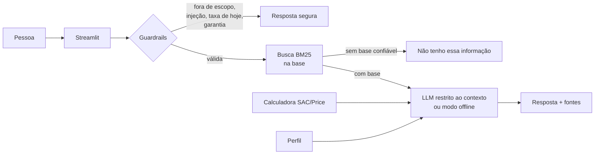

# 🏠 Liv: Educadora Financeira para Financiamento Imobiliário

Assistente virtual com IA que **ensina financiamento imobiliário em linguagem simples**, simula SAC e Price e ajuda a pessoa a entender se a parcela cabe na sua renda, sem inventar respostas.

> Projeto do Lab **"Construa Seu Assistente Virtual Com Inteligência Artificial"** (DIO), baseado no desafio *Agente Financeiro Inteligente com IA Generativa*.

---

## 💡 O problema e a solução

Financiar um imóvel costuma ser a maior dívida da vida de uma pessoa, e muita gente chega ao banco sem entender SAC, Price, CET, seguros ou o que compõe a parcela. A **Liv**:

- 📚 **Explica** conceitos (entrada, SAC, Price, juros, CET, FGTS, documentos, custos, portabilidade...)
- 🧮 **Simula** financiamentos SAC e Price com fórmulas matemáticas (o modelo de IA não faz contas)
- 👤 **Personaliza** com o perfil da pessoa: a parcela cabe na renda? (referência de 30%)
- 🛡️ **Não inventa**: sem base confiável, diz *"não tenho essa informação"* e indica onde confirmar
- 🚫 **Sabe seus limites**: não aprova crédito, não recomenda banco, não informa taxa de hoje

## ▶️ Como executar

Requisitos: Python 3.10+.

```bash
# 1. Instale as dependências
pip install -r requirements.txt

# 2. (Opcional) configure um LLM
cp .env.example .env     # e preencha UMA chave de API, ou use Ollama local

# 3. Rode o app
streamlit run src/app.py
```

**Sem nenhuma chave, o app funciona em modo offline**: as respostas são montadas direto da base de conhecimento, com simulador e guardrails completos. Com uma chave, a IA generativa reescreve a resposta de forma mais natural, sempre restrita ao contexto recuperado.

| Provedor | Configuração no `.env` | Modelo padrão |
|---|---|---|
| Claude (Anthropic) | `ANTHROPIC_API_KEY=...` | `claude-haiku-4-5-20251001` |
| OpenAI | `OPENAI_API_KEY=...` | `gpt-4o-mini` |
| Google Gemini | `GEMINI_API_KEY=...` | `gemini-2.5-flash` |
| Ollama (local, grátis) | `LLM_PROVIDER=ollama` | `llama3.2` |

Use `LLM_MODEL=...` para trocar o modelo.

### Avaliação
```bash
python src/evaluate.py      # 63 casos + calculadora, sem precisar de chave de API
```

## 🧭 Os 6 passos do desafio

| # | Passo | Onde está |
|---|---|---|
| 1 | Documentação do agente (caso de uso, persona, arquitetura, segurança) | [`docs/01-documentacao-agente.md`](docs/01-documentacao-agente.md) |
| 2 | Base de conhecimento | [`docs/02-base-conhecimento.md`](docs/02-base-conhecimento.md) · [`data/`](data/) |
| 3 | Prompts (system prompt, exemplos, edge cases) | [`docs/03-prompts.md`](docs/03-prompts.md) · [`src/prompts.py`](src/prompts.py) |
| 4 | Aplicação funcional (Streamlit) | [`src/`](src/) |
| 5 | Avaliação e métricas | [`docs/04-metricas.md`](docs/04-metricas.md) · [`src/evaluate.py`](src/evaluate.py) |
| 6 | Pitch de 3 minutos | [`docs/05-pitch.md`](docs/05-pitch.md) |

## 🏗️ Arquitetura em resumo



## 🛡️ Como evitamos alucinação

1. **Resposta só com contexto recuperado** (system prompt restritivo + busca com limiar de confiança)
2. **Sem base, sem chute:** se a busca não é confiável, o LLM nem é chamado
3. **Contas fora do modelo:** simulações vêm de `calculadora.py`, validada contra valores de referência
4. **Guardrails determinísticos** para taxa de hoje, garantia de aprovação, injeção de prompt e fora de escopo
5. **Transparência:** cada resposta mostra as fontes usadas

## 📊 Resultados da avaliação (modo offline)

| Métrica | Resultado |
|---|---|
| Recuperação do trecho certo (Hit@1 / Hit@3) | 95% / 100% (37 perguntas) |
| Guardrails tratados corretamente | 100% (21 casos) |
| Respostas seguras (sem frases proibidas) | 100% (58 respostas) |
| Calculadora SAC/Price | 11/11 testes |

Detalhes, falhas encontradas e limitações em [`docs/04-metricas.md`](docs/04-metricas.md).

## 📁 Estrutura

```
├── README.md
├── requirements.txt
├── .env.example
├── data/
│   ├── base_conhecimento.json      # 31 conceitos sobre financiamento imobiliário
│   ├── linhas_financiamento.json   # SBPE, MCMV, SFI, construção, home equity
│   ├── perfil_cliente.json         # perfil fictício para demonstração
│   ├── historico_atendimento.csv   # dúvidas anteriores (fictício)
│   └── casos_teste.json            # casos da avaliação
├── docs/                           # documentação dos 6 passos
└── src/
    ├── app.py                      # interface Streamlit (chat + simulador)
    ├── agent.py                    # guardrails, orquestração e fallback
    ├── conhecimento.py             # carga da base e busca BM25
    ├── calculadora.py              # SAC, Price, renda mínima
    ├── llm.py                      # Anthropic / OpenAI / Gemini / Ollama
    ├── prompts.py                  # system prompt e respostas padrão
    └── evaluate.py                 # avaliação automatizada
```

## ⚠️ Limitações e avisos

- **Conteúdo educativo.** Não é oferta, recomendação de investimento nem aprovação de crédito. Sempre confirme taxas, tetos e regras com a instituição financeira.
- Todos os dados de perfil e atendimento são **fictícios**; a taxa de juros do simulador é hipotética.
- A simulação é simplificada: não inclui TR/IPCA, amortizações extraordinárias nem regras específicas de cada banco.
- A base é pequena e generalista, e a busca é lexical (perguntas com vocabulário muito diferente podem não ser encontradas; nesse caso o agente admite que não sabe).

## 🚀 Próximos passos

- Busca semântica com embeddings para cobrir mais formas de perguntar
- Simulador com TR/IPCA, seguros por faixa etária e amortização extraordinária
- Botões 👍/👎 para coletar avaliação das respostas
- Mais conteúdos: imóvel na planta, imposto de renda, financiamento a dois
"# bootcampdiobradesco-liv-agente-financeiro" 
