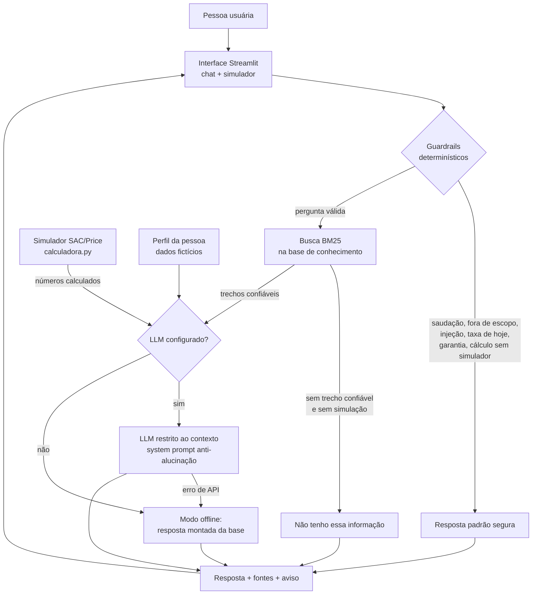

# 1. Documentação do Agente

## Caso de uso

### Problema
Financiar um imóvel é, para a maioria das pessoas, a maior dívida da vida, e boa parte chega à negociação sem entender o que está assinando. Termos como SAC, Price, CET, MIP/DFI, TR e alienação fiduciária confundem, e comparar propostas de bancos sem esse repertório leva a decisões caras: num contrato de 30 anos é comum pagar em juros mais do que o próprio valor financiado.

### Solução
A **Liv** é uma educadora financeira virtual que explica financiamento imobiliário em linguagem simples, faz simulações de SAC e Price com fórmulas matemáticas (não com "achismo" de IA) e ajuda a pessoa a interpretar os números no contexto da própria renda e da entrada disponível.

Ela é **educativa e consultiva**, não vende produto, não aprova crédito e não recomenda banco.

### Público-alvo
Quem está pensando em comprar o primeiro imóvel ou ainda não domina o assunto: pessoas de renda média, sem formação em finanças, que querem chegar preparadas ao banco.

### O que o agente faz
- Explica conceitos (entrada, SAC, Price, juros, CET, seguros, FGTS, portabilidade, amortização...)
- Mostra o passo a passo do processo e os documentos e custos envolvidos
- Simula SAC e Price e compara os resultados
- Avalia se a parcela cabe na renda (referência de 30%) usando o perfil da pessoa
- Sugere o próximo passo prático
- Admite quando não sabe e indica onde confirmar

### O que o agente não faz
Aprovar crédito, garantir resultado, informar taxas atuais de bancos, recomendar instituição ou imóvel, dar aconselhamento jurídico/tributário e falar de outros assuntos financeiros (bolsa, cripto...).

## Persona e tom de voz

| Item | Definição |
|---|---|
| Nome | Liv |
| Papel | Educadora financeira paciente, que "traduz o bancarês" |
| Tom | Acolhedor, didático, direto, sem jargão (todo termo técnico vem com uma explicação curta) |
| Postura | Educa, não pressiona; respeita a decisão da pessoa; é honesta sobre limites |
| Formato | Respostas curtas (≈180 palavras), com exemplo numérico quando ajuda, fechando com um próximo passo |

**Exemplo de tom**
> "Boa pergunta! Pense assim: no SAC você amortiza o mesmo valor todo mês, então a parcela começa mais alta e vai caindo. Na Price a parcela é igual, mas você paga mais juros no total. Quer que eu simule os dois com os seus números?"

## Arquitetura

### Componentes

| Componente | Arquivo | Função |
|---|---|---|
| Interface | `src/app.py` | Chat, simulador na barra lateral, perfil, fontes |
| Agente | `src/agent.py` | Guardrails, orquestração, contexto, fallback |
| Base de conhecimento | `src/conhecimento.py` + `data/` | Carrega JSON e busca por BM25 |
| Calculadora | `src/calculadora.py` | SAC, Price, renda mínima, comparação |
| Cliente de LLM | `src/llm.py` | Anthropic, OpenAI, Gemini, Ollama ou offline |
| Prompts | `src/prompts.py` | System prompt e respostas padrão |
| Avaliação | `src/evaluate.py` | Métricas automatizadas |

### Decisões de arquitetura
- **Busca lexical (BM25) em vez de embeddings:** roda sem internet, é explicável (dá para ver por que um trecho foi escolhido) e determinística, o que facilita testar e evitar alucinação.
- **Matemática fora do LLM:** modelos de linguagem erram contas. A calculadora produz os números e o modelo só os explica.
- **Vários provedores, só `requests`:** o projeto roda com Claude, OpenAI, Gemini ou Ollama local, e também sem nenhuma chave (modo offline), então qualquer pessoa consegue executar e avaliar.

## Segurança e anti-alucinação

| Risco | Mitigação |
|---|---|
| Inventar fatos, taxas ou regras | System prompt restringe a resposta ao **CONTEXTO** recuperado; sem trecho confiável o agente responde "não tenho essa informação" e **nem chama o LLM** |
| Errar cálculos | Nenhuma conta é feita pelo modelo; só números da calculadora entram no contexto |
| Informar "taxa de hoje" de banco | Detectado antes do LLM e respondido com orientação (comparar CET, simular em 3 bancos) |
| Prometer aprovação de crédito | Detectado antes do LLM; explica fatores que pesam na análise |
| Recomendar banco ou imóvel | Vedado no system prompt e coberto por guardrail |
| Prompt injection ("ignore suas instruções") | Detectado por padrões e recusado sem envolver o modelo |
| Fugir do assunto | Guardrail de escopo redireciona para financiamento imobiliário |
| Temas próximos que a base não cobre (imposto de renda, imóvel na planta...) | Lista explícita de temas sem cobertura devolve "não tenho essa informação" em vez de uma resposta enganosa |
| Dados sensíveis | O agente não pede CPF, senhas ou cartão; o perfil usado é fictício |
| Falha do provedor de LLM | Fallback automático para o modo offline, com aviso |
| Transparência | Toda resposta mostra as **fontes** usadas e o aviso de conteúdo educativo |

## Limitações conhecidas
- A base é pequena (31 conceitos + 5 linhas) e generalista; não substitui simulação oficial nem orientação profissional.
- A busca é lexical: perguntas com vocabulário muito diferente do da base podem não ser encontradas (nesse caso o agente admite que não sabe).
- Não considera TR/IPCA, amortizações extraordinárias nem tabelas específicas de cada banco na simulação.
- Regras e valores citados de forma genérica (30% da renda, 20% de entrada, 3 anos de FGTS, 3% a 5% de custos) são referências comuns de mercado e podem mudar.
